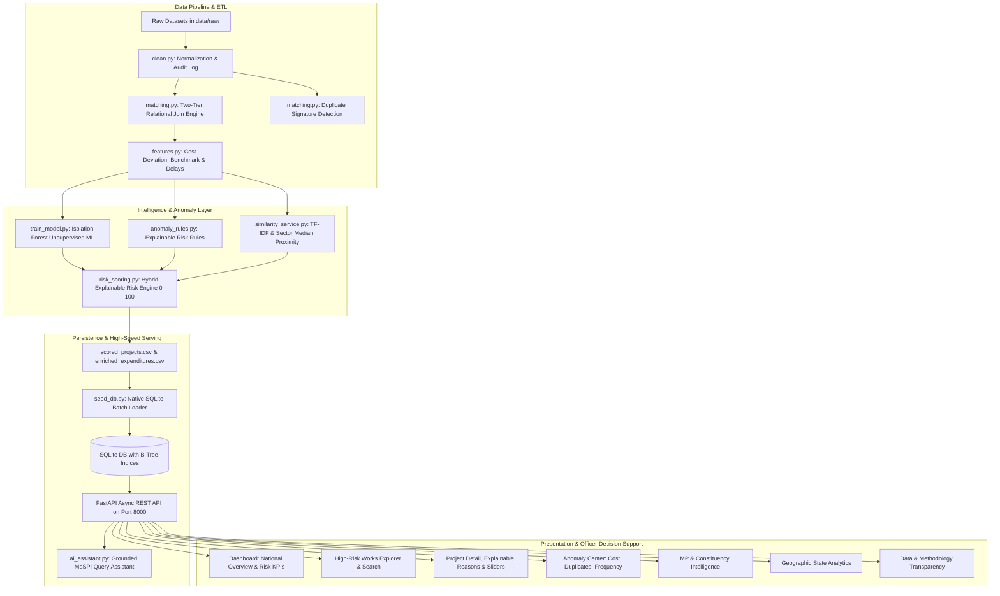

# System Architecture: MPLAD AI Risk & Anomaly Intelligence System

## 1. High-Level System Architecture

---

## 2. Component Design & Responsibilities

### A. Data Ingestion & Transformation (`backend/data_pipeline/`)
1. `clean.py`: High-performance vectorized cleaning of whitespace, date normalization (ISO-8601 `YYYY-MM-DD`), numeric parsing, and IDA district extraction.
2. `matching.py`: Connects Recommended Works and Completed Works via direct `Work ID` (Tier 1) and normalized composite hashing (Tier 2). Assigns match confidence and designates unverified projects.
3. `features.py`: Computes cost deviation percentages, project duration days, delay categorization, category median benchmarks, and aggregates linked transaction statistics.
4. `seed_db.py`: Ingests processed datasets into SQLite and constructs B-Tree indexes on `project_id`, `state`, `district`, `constituency`, `category`, `risk_level`, `risk_score`, and `transaction_id`.

### B. Anomaly Intelligence & Machine Learning (`backend/app/services/` & `ml_models/`)
1. **Unsupervised Isolation Forest (`ml_models/train_model.py`)**:
   - Trained on 11 numerical and encoded features (`recommended_amount`, `final_amount`, `cost_deviation_pct`, `category_cost_deviation_pct`, `project_duration_days`, `has_images_numeric`, `match_confidence`, `tx_count`, `tx_total_amount`, `tx_exact_duplicate_count`, `tx_repeated_signature_count`).
   - Identifies multi-dimensional statistical outliers without label leakage.
2. **Explainable Risk Engine (`backend/app/services/risk_scoring.py`)**:
   - Calculates transparent point contributions (Max 100 points) and maps to 4 distinct risk tiers (`LOW`, `MEDIUM`, `HIGH`, `CRITICAL`).
   - Generates plain-English explanation text and prioritized advisory action items.
3. **Similarity & Comparable Benchmarking (`backend/app/services/similarity_service.py`)**:
   - Filters projects within the same sector and state, calculating the peer median cost and deviation percentage.
4. **Grounded AI Decision-Support Assistant (`backend/app/services/ai_assistant.py`)**:
   - Interprets natural language queries from inspecting officers and executes deterministic SQL queries to provide cited factual answers.

### C. Presentation Layer (`frontend/`)
- Built with React 19, Vite, Tailwind CSS v4, and Recharts.
- Provides interactive visualizations, search toolbars, dynamic weight adjustment sliders, and PDF/printable dossier export.
